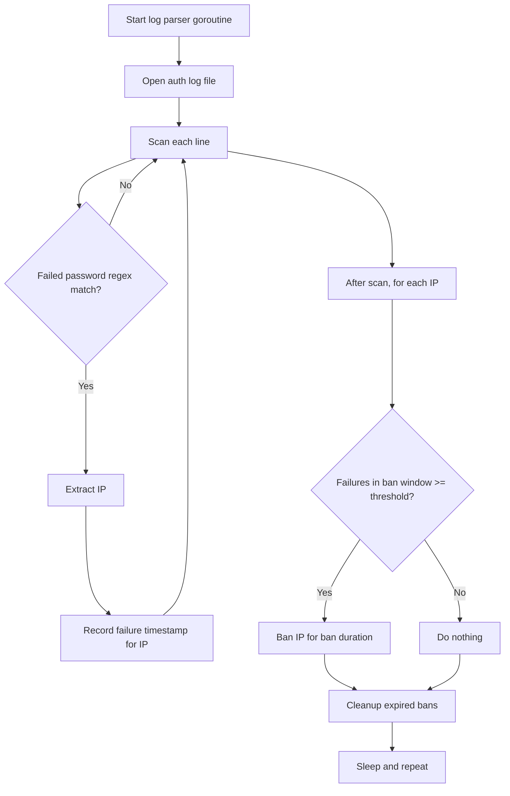

# sshproxy

## Usage

Build or run directly with Go:

```bash
# Build binary
cd sshproxy/cmd
go build -o sshproxy

# Or run without building
go run . <listen_addr> <target_addr>
```

Example:

```bash
./sshproxy :2244 localhost:2222
```

Positional arguments:

- `listen_addr`: TCP address the proxy listens on (e.g. `:2244` or `0.0.0.0:2244`)
- `target_addr`: Upstream SSH server address (e.g. `localhost:2222`)

Environment variables:

- `SSHPROXY_LOG_LEVEL` (optional): `debug`, `info` (default), `warn`, `error`
- `SSHPROXY_AUTH_LOG` (optional): Path to auth log to scan for failed attempts (default: `/var/log/auth.log`)

Ban logic (current defaults – not yet configurable via flags/env):

- Threshold: 5 failed password attempts
- Window: 10 minutes (failures counted within this interval)
- Ban duration: 10 minutes

The proxy tails (periodically rereads) the specified auth log every 60s, aggregates failed password attempts per IP using a regex match on lines like:

```
Failed password for <user> from <ip> port <port> ssh2
```

When an IP reaches the threshold within the time window, it is banned for the ban duration. Incoming connections from banned IPs are immediately closed.

Logging output is written in text format to stderr.

Security note: This implementation performs a periodic full read of the log file (not incremental tailing) and stores ban state in memory only; bans reset when the process restarts. Adjust accordingly for production use.

### Logging

You can set the log level for `sshproxy` using the `SSHPROXY_LOG_LEVEL` environment variable. Supported levels are `debug`, `info`, `warn`, and `error`. For example:

```bash
SSHPROXY_LOG_LEVEL=debug ./sshproxy <listen_addr> <target_addr>
```

If not set, the default log level is `info`.

## Ban Logic Diagram



## Developing

### Prerequisites
- Go (latest stable version recommended)
- A running ssh server listening on `localhost:2222`
- Docker (for containerized tests)

#### Set up keys for testing

```bash
cd sshproxy/test
ssh-keygen -t ed25519 -N "" -f clientkey
ssh-keygen -t ed25519 -N "" -f serverkey
cat ./clientkey.pub >> authorized_keys
```

#### Set up upstream ssh server for testing

##### SSH Server on Host

```bash
cd sshproxy/test
cat ./clientkey.pub >> ~/.ssh/authorized_keys # create this file if it doesn't exist
```
##### SSH Server in Docker

You can also set up a ssh server in Docker for testing purpose.

```bash
cd sshproxy/test
# Build the Docker image
docker build -t sshproxy-test .
# Run the container
# (You may need to map ports or mount volumes as needed)
docker run -d -p 2222:22 sshproxy-test
```

### Testing

This directory contains the SSH proxy implementation and its tests.


#### Generate Test Logs

To generate `auth_not_banned.log` and `auth.log` for testing, use the provided scripts:

**Go script:**
```bash
cd sshproxy/test/generate_auth_logs
go run get_auth_logs.go
```


You can set environment variables to customize the SSH connection and log generation:

- `SSH_HOST` (default: 127.0.0.1)
- `SSH_PORT` (default: 2222)
- `SSH_USER` (default: root)
- `SSH_KEY` (default: clientkey)
- `LOG_DIR` (default: ..)
- `REMOTE_IP` (optional: specify the client IP to use in logs; if unset, the script will auto-detect your local IP)

Example:

```bash
# Use auto-detected local IP
SSH_HOST=localhost SSH_PORT=2222 SSH_USER=root SSH_KEY=clientkey go run get_auth_logs.go

# Specify a custom REMOTE_IP
REMOTE_IP=192.168.1.100 go run get_auth_logs.go
```


### Unit Tests

To run the Go unit tests:

```bash
cd sshproxy
# Run all tests
go test ./...
```


### Files
- `cmd/sshproxy.go`: Main proxy implementation
- `cmd/sshproxy_test.go`: Unit tests
- `cmd/authorized_keys`: Example authorized keys file
- `test/Dockerfile`: Integration test environment
- `test/testkey`, `test/testkey.pub`: Test SSH keys

---

For more details, see comments in the source files.
